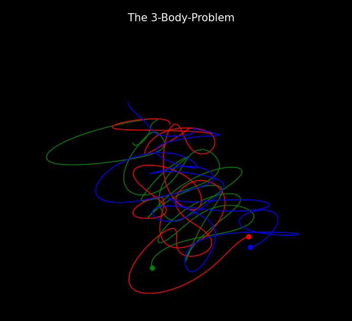

# 🪐 3-Body Problem Simulation

This Python project visualizes the fascinating dynamics of the **3-body problem**, where three celestial bodies interact through gravitational forces. Watch as the simulation brings to life the complex orbital dance of these bodies in stunning 3D animation! because i love Physics 😍

## 🎥 Demo
- [Click Here to Watch the Video](https://www.canva.com/design/DAGXTjL6fIo/O6Lpq7rySUC9_DdD35Eg0w/watch?utm_content=DAGXTjL6fIo&utm_campaign=designshare&utm_medium=link&utm_source=editor) <br><br>
<p align="center">
  
</p>


## 🌟 Key Features
- 🔧 **Precise Physics**: Solves gravitational equations using `scipy.integrate.solve_ivp`
- 🎨 **Beautiful Visualization**: Renders trajectories in an elegant dark-themed 3D space
- 🎬 **Smooth Animation**: Real-time animation of orbital motions
- ⚙️ **Customizable**: Easy modification of masses, positions, and velocities
- 🎯 **Interactive**: Full 3D rotation, zoom, and pan controls

## 🚀 Getting Started

### Prerequisites
- Python 3.x
- Basic understanding of Physics and Python

### Installation

1. **Clone the repository**
```bash
git clone https://github.com/hetbhalani/3-Body-Problem.git
cd 3-Body-Problem
```

2. **Install dependencies**
```bash
pip install -r requirements.txt
```

3. **Run the simulation**
```bash
python main.py
```

## ⚙️ Configuration

Customize the simulation by modifying these parameters:

```python
# Masses
m1, m2, m3 = 1, 1, 1

# Initial Positions
initial_pos_1 = [1.0, 0.0, 1.0]
initial_pos_2 = [1.0, 1.0, 0.0]
initial_pos_3 = [0.0, 1.0, 1.0]

# Initial Velocities
initial_velocity_1 = [0.1, 0.0, -1.0]
initial_velocity_2 = [0.0, 0.0, 1.0]
initial_velocity_3 = [0.0, 0.0, -0.6]
```

## 📝 Requirements
- numpy
- matplotlib
- scipy

## 💡 About the 3-Body Problem
The three-body problem is a complex physics challenge that models the motion of three masses under mutual gravitational attraction. Unlike the two-body problem, it has no general closed-form solution, making numerical methods necessary for visualization.

## 🤝 Contributing
Contributions are welcome! Feel free to:
- 🐛 Report bugs
- 💡 Suggest features
- 🔧 Submit pull requests

## ⭐ Show Your Support
If you found this project interesting or helpful, please consider giving it a star! ⭐

## 🙏 Acknowledgments
special thanks to "Younes Lab" to teach me this <br>
check it out here: https://youtu.be/FXkH9-4EN_8?si=Ye7P9cZJWohRFme_

